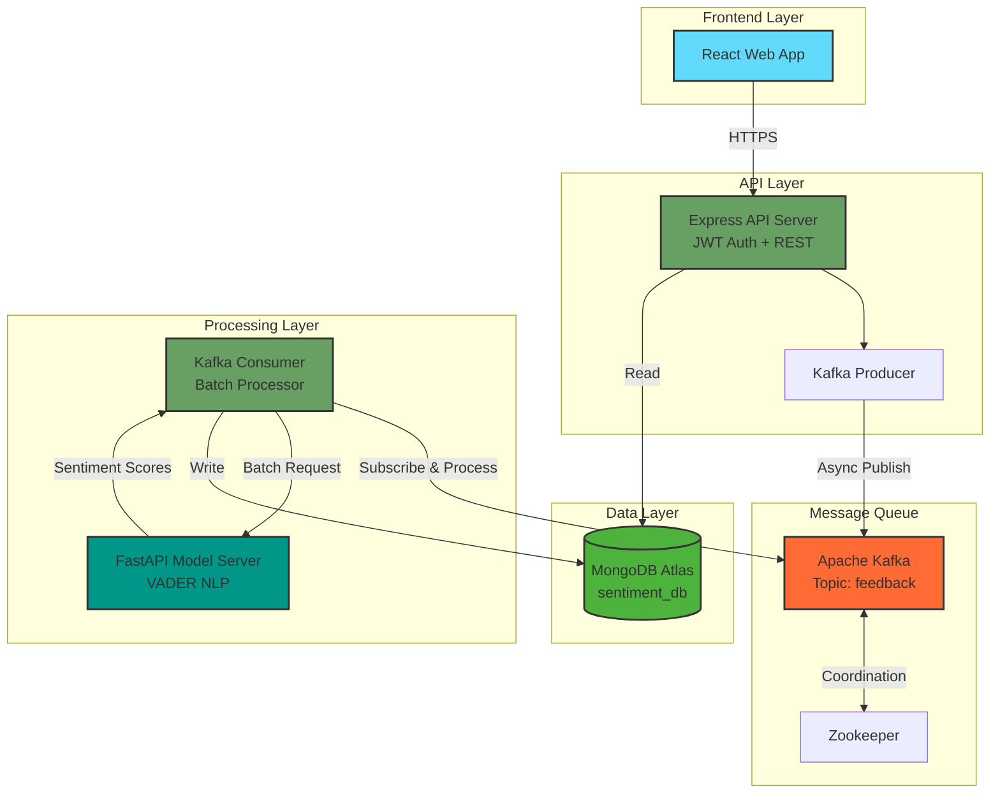
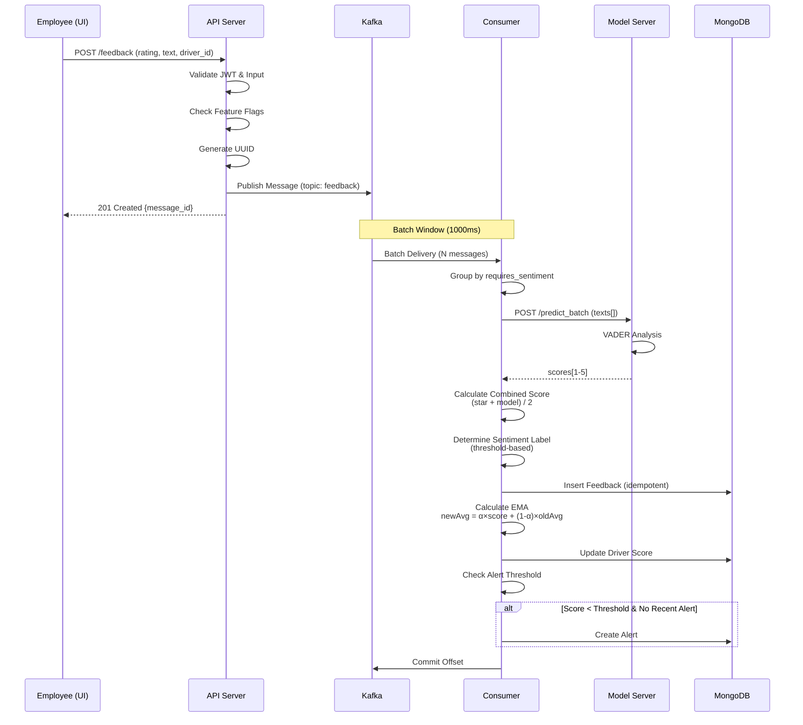
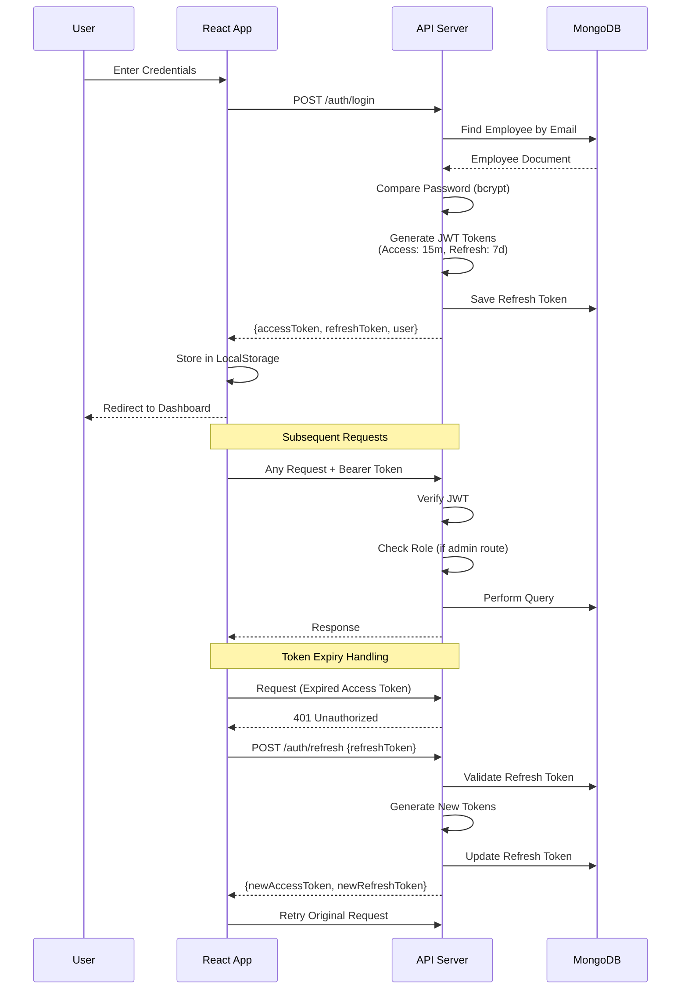

# Driver Sentiment Engine 🚗💬

[](https://nodejs.org/)
[](https://python.org/)
[](https://react.dev/)
[](https://mongodb.com/)

A production-grade, scalable real-time sentiment analysis system for processing multi-entity feedback (drivers, trips, marshals, app) with intelligent alerting and configurable thresholds. Built using event-driven microservices architecture with Kafka message streaming.

---

## 🎯 Overview

The Driver Sentiment Engine is an enterprise-level feedback processing system designed for MoveInSync to analyze employee feedback across multiple entities. It uses Natural Language Processing (NLP) for sentiment analysis combined with manual star ratings to generate comprehensive driver performance metrics using Exponential Moving Average (EMA) for time-series smoothing.

## ✨ Features

### Core Functionality
- **Multi-Entity Support**: Feedback for drivers, trips, app experience, and marshals
- **Hybrid Sentiment Analysis**: Combines manual ratings (1-5 stars) with AI-powered text analysis
- **Real-Time Processing**: Sub-second feedback processing using Kafka batch consumer
- **Intelligent Alerting**: Automatic alerts for drivers below configurable threshold
- **Performance Tracking**: EMA-based driver scoring for trend analysis
- **Feature Flags**: Enable/disable feedback types dynamically

### User Features
- **Employee Portal**: Submit feedback with searchable driver lookup
- **Admin Dashboard**: 
  - Real-time statistics and sentiment distribution
  - Driver performance rankings with sortable tables
  - Alert management for low-performing drivers
  - Complete feedback history with filters
  - System configuration panel

### Technical Features
- **Batch Processing**: Processes messages in batches for efficiency
- **Idempotency**: Duplicate prevention using unique message IDs
- **Horizontal Scalability**: Kafka consumer groups for load distribution
---

## System Architecture

### High-Level Architecture



### Component Breakdown

#### 1. **Frontend (React)**
- **Technology**: React, React Router, Axios, Recharts
- **Responsibilities**:
  - User authentication (Login/Register)
  - Feedback submission with driver search
  - Admin dashboard with real-time charts
  - System configuration management
- **Design Pattern**: Component-based architecture with hooks

#### 2. **API Server (Express.js)**
- **Technology**: Node.js, Express, JWT, Mongoose
- **Responsibilities**:
  - RESTful API endpoints
  - JWT authentication & authorization
  - Input validation (express-validator)
  - Kafka message production
  - Database queries (MongoDB)
- **Design Pattern**: MVC with middleware pipeline

#### 3. **Message Queue (Kafka)**
- **Technology**: Apache Kafka 7.5.0, Zookeeper
- **Responsibilities**:
  - Decouple API from processing
  - Message buffering and durability
  - Load distribution across consumers
  - Fault tolerance through replication
- **Configuration**: 
  - Partition key: entity_id (for ordering)

#### 4. **Consumer (Node.js Worker)**
- **Technology**: Node.js, KafkaJS, Mongoose, Axios
- **Responsibilities**:
  - Batch message consumption
  - Sentiment prediction coordination
  - EMA calculation for driver scores
  - Alert generation logic
  - Database writes with idempotency
- **Design Pattern**: Event-driven processing with async/await
- **OOP Principles**: Separation of concerns (consumer, sentiment service, database layer)

#### 5. **Model Server (FastAPI)**
- **Technology**: Python 3.11, FastAPI, VADER Sentiment
- **Responsibilities**:
  - Batch sentiment analysis
  - Score normalization ([-1, 1] → [1, 5])
  - RESTful inference API
- **Design Pattern**: Microservice with REST API
- **Algorithm**: VADER (Valence Aware Dictionary and sEntiment Reasoner)

#### 6. **Database (MongoDB Atlas)**
- **Technology**: MongoDB (Cloud)
- **Responsibilities**:
  - Persistent data storage
  - Indexed queries for performance
  - ACID transactions support
- **Collections**: 
  - `employees` - User accounts
  - `drivers` - Driver profiles with scores
  - `feedbacks` - All feedback records
  - `alerts` - Alert history
  - `configs` - System configuration

---

## 🔄 Data Flow

### 1. Feedback Submission Flow



### 2. Authentication Flow



---

## 🧠 Evaluation Criteria Coverage

### 1. Authentication
- JWT-based secure authentication with access and refresh tokens
- Role-based access control with protected routes for Admin and Employee

### 2. Cost Estimation - Time & Space
- Optimized time complexity using indexed MongoDB queries and Kafka batch processing
- Horizontal scaling via Kafka consumer groups for load distribution

### 3. System Failure Handling
- Auto-reconnect with exponential backoff for database and Kafka failures
- Graceful degradation with circuit breaker pattern and idempotent writes

### 4. Object-Oriented Programming (OOPS)
- Encapsulation and abstraction using Mongoose models and service layers
- Single Responsibility Principle with separate modules for auth, sentiment, and database

### 5. Trade-offs
- Eventual consistency over strong consistency for better throughput and horizontal scaling
- Batch processing over real-time for improved performance and lower infrastructure cost

### 6. System Monitoring
- Real-time consumer statistics and admin dashboard with sentiment breakdown
- Health check endpoints and structured logging for observability

### 7. Error & Exception Handling
- Input validation with Express-validator and meaningful error responses
- Kafka: Batch processing wrapped in try-catch, offset only committed on success
---

## 🧩 Tech Stack

| Layer              | Stack                                                                 |
|--------------------|----------------------------------------------------------------------|
| **Backend**        | Node.js · Express.js · MongoDB · Mongoose · JWT · Kafka · KafkaJS |
| **AI / ML Service**| Python · FastAPI · Uvicorn · VADER Sentiment                         |
| **Frontend**       | React · React Router · Axios · Recharts · React Scripts              |
| **DevOps & Infra** | Docker · Docker Compose · Apache Kafka + Zookeeper|


## 📦 Prerequisites

Before installation, ensure you have:

- **Docker Desktop** (v20.0+) - [Download](https://www.docker.com/products/docker-desktop/)
- **Node.js** (v18.0+) - [Download](https://nodejs.org/)
- **Python** (v3.11+) - [Download](https://www.python.org/downloads/)
- **MongoDB Atlas Account** - [Sign Up](https://www.mongodb.com/cloud/atlas/register)
- **Git** - [Download](https://git-scm.com/downloads)

### System Requirements
- **RAM**: Minimum 8GB (16GB recommended)
- **Storage**: 5GB free space
- **OS**: Windows 10/11, macOS 10.15+, or Linux
- **Ports**: 3000, 3001, 8000, 9092, 2181 must be available

---

## 🚀 Installation

### 1. Clone the Repository

```bash
git clone https://github.com/YOUR_USERNAME/Driver-Sentiment.git
cd Driver-Sentiment
```

### 2. Set Up MongoDB Atlas

1. Create a free cluster at [MongoDB Atlas](https://www.mongodb.com/cloud/atlas)
2. Create a database user with read/write permissions
3. Whitelist your IP address (or use `0.0.0.0/0` for development)
4. Copy your connection string

### 3. Configure Environment Variables

### 4. Install Dependencies

#### API Server
```bash
cd api-server
npm install
```

#### Consumer
```bash
cd ../consumer
npm install
```

#### Model Server
```bash
cd ../model-server
pip install -r requirements.txt
```

#### Frontend
```bash
cd ../employee-ui
npm install
```
---

### Starting the project server :-

#### Step 1: Start Kafka & Zookeeper
```bash
docker-compose up -d
```

#### Step 2: Start Model Server
```bash
cd model-server
python main.py
```
Server runs on: `http://localhost:8000`

#### Step 3: Start API Server
```bash
cd api-server
npm start
```
Server runs on: `http://localhost:3000`

#### Step 4: Start Consumer
```bash
cd consumer
npm start
```

#### Step 5: Start Frontend
```bash
cd employee-ui
npm start
```
---
App opens at: `http://localhost:3001`


## 👥 Author
**Developed by:** Kushagra Pandey  

**Contact:**  kushagrapandey95556@gmail.com
